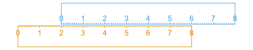

**Overview**

This repository is for the development of oceanographic slide rules, akin to
the general slide rules that were popular until handheld calculators became
common. Although direct computation with software offers more accurate results,
these slide rules have a didactic advantage, in the sense that they can yield
enhanced intuition regarding the essence of the underlying formulae.

**How a slide rule works**

For those who have not used a conventional side rule, a little bit of
explanation is in order.  It's simple. The basic idea is to use sliding rulers
to combine functions in an additive way.

Consider the diagram above, which sketches two rulers made of
rectangular pieces of wood.  The orang ruler has a linear scale on the upper
edge, and blue ruler has an identical scale, but on its lower edge. The rulers
are placed on a table, or held within a container, in such a way that the
scales touch.  Then, adding two numbers is a simple matter of sliding the
rulers.  For example, the sum of 2 and 3 may be found by placing the 0 of the
upper ruler alongside 2 on the lower ruler, and then looking over to 3 on the
upper ruler, which will be immediately above 5 on the lower ruler.  In a slide
rule, there is a transparent pointer that has a line marked orthogonal to the
scales, which makes it easy to line up the 3 of the upper scale with the 5 of
this example.

In this example, the rulers are a form of mechanical (analogue) computer for
addition.  It should be obvious that the system also works for subtraction.
And, if the scales are switched from linear to logarithmic form, then
multiplication and division are possible.  For this reason, a conventional
slide rule has a sequence of scales, some linear (for $x+y$ and $x-y$), some
logarithmic (for $xy$ and $x/y$), and some with other functions, such as the
trigonometric functions.

**Oceanographic slide rules**

In the oceanographic case, there are some specialized functions that do not fit
these general forms. For example, the density of seawater is a function of
salinity $S$, temperature $T$, and pressure $p$.  This function has cross terms
that depend on combinations of $S$, $T$ and $p$. However, an approximate
function can be constructed (through regression of data from the actual
function) as a sum of three functions, some $f_1(S)$ plus some $f_2(T)$ plus
some $f_3(p)$.

This is the basic idea of the slide rules presented in this repository.  Each
slide rule gets its own subdirectory here, with at least a brief explanation of
the analysis in a README file in the directory.

**Progress**

*Done and tested*

* $\sigma_\theta$ from $S$, $T$ and $p$: see [sigthe](sigthe)

*Done but not yet tested*

* sound speed from $S$, $T$ and $p$: see [sound_speed](sound_speed)

*Possible plans*

* distance from delta-lon and delta-lat
* buoy knockdown from radius and water speed
* something to do with instrument time-constants
* something to do with waves. NB: the dispersion relationship is hard because
  it is not in the form $z=f_1(x_1)+f_2(x_2)$.
* something to do with gliders, perhaps buoyancy adjustment or adjusting
  waypoints for currents.

