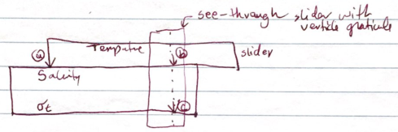

```{r echo=FALSE}
load("00.rda")
load("01.rda")
load("02.rda")
```

# Concept

In a linear equation of state, assuming constant pressure $p$, density is given
by

\begin{equation}
\label{e1}
\rho = \rho(S_0,T_0,p) - \rho_0(\beta(S-S_0)-\alpha(T-T_0)
\end {equation}
where $\alpha=-\rho^{-1}\partial\rho/\partial T$ and
$\beta=\rho^{-1}\partial\rho/\partial S$ are constants set up to approximate
the actual equation of state at the desired target pressure, and over a desired
range of $S$ and $T$.

Since density in \eqref{e1} is given by the sum of a linear function of $S$ plus
a linear function of $T$, a slide-rule can be set up to do this calculation.
The idea, as with a common slide rule, is to have sliding scales and a pointer.
Figure 1 sketches the general idea.

Extending this to a nonlinear equation of state would be easy, if cross-terms
(i.e. terms relating to $ST$) can be neglected.  In this scheme, the equation
of state would be written
\begin{equation}
\label{e2}
\rho = \rho_0 - \rho_0 f(S-S_0))-\alpha g(T-T_0))
\end {equation}
where $f$ and $g$ are functions that could be determined to fit the actual
equation of state over a reasonable application range.

# Apparatus

 The diagram above illustrates the
idea for a linear slide rule^[A circular slide rule would be more interesting
to use, and could be constructed from cardboard, a sheet of mylar, and a rivet.
The linear form is shown here only because it was what I drew when I had the
idea.].  There are two sliding scales. The lower one has $\sigma_t$ on the
bottom side and $S$ on the top side.  The upper one has $T$ on the lower side.


# Usage

Given $S$ and $T$, density $\rho$ is calculated as follows.

1. Slide the upper scale until the arrow at the left of the $T$ scale lines up
   with the observed $S$.

2. Slide the transparent overlay until its vertical line is on the $T$ of
   interest.

3. Determine $\rho$ by tracing this vertical line down to the bottom scale.

The device can also be used in other ways, e.g. infer $T$, given $S$ and
$\rho$.

# Working notes

```{r echo=FALSE}
options(digits=5)
```

## First-order model
Linear least-squares regression analysis (see `01.R`) on an `r n` by `r n`
grid covering $`r S0`<S<`r Smax`$ and $`r T0`<T<`r Tmax`$ yields
\begin{equation}
\label{e3}
\sigma_\theta = `r C01[1]` +`r C01[2]`(S-S_0) - `r -C01[3]`(T-T_0)
\end{equation}
with $S_0=`r S0`$, $T_0=`r T0`^\circ$C, at pressure $p=`r p`$dbar.  The RMS
misfit of this model is `r round(RMS(res01),3)` kg/m$^3$, which is equivalent
to $`r round(100*RMS(res01)/sigtheRange01,1)`$ percent of the $\sigma_\theta$
range.

## Second-order model


Second-order polynomial least-squares regression analysis (see `02.R`) on an `r n` by `r n`
grid covering $`r S0`<S<`r Smax`$ and $`r T0`<T<`r Tmax`$ yields
\begin{equation}
\label{e4}
\sigma_\theta = `r C02[1]` +`r C02[2]`(S-S_0) + `r C02[3]`(S-S_0)^2-`r -C02[4]`(T-T_0)-`r -C02[5]`(T-T_0)^2
\end{equation}
with $S_0=`r S0`$, $T_0=`r T0`^\circ$C, at pressure $p=`r p`$dbar.  The RMS
misfit of this model is `r round(RMS(res02),3)` kg/m$^3$, which is equivalent
to $`r round(100*RMS(res02)/sigtheRange02,1)`$ percent of the $\sigma_\theta$
range.


